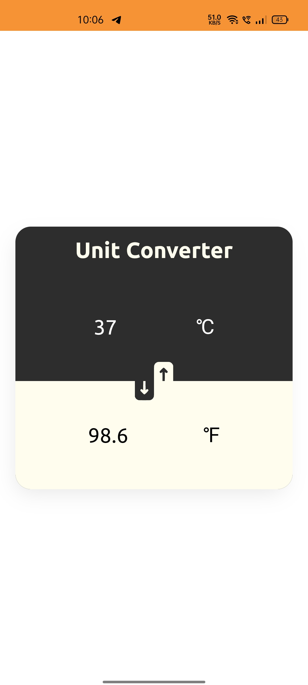

### Uniconv

Basic Unit Converter from Scratch PWA. Html, Css, Typescript, Webpack

> This acts like a Standalone app when installed.

### Screenshot



### Table of Content

- [Uniconv](#uniconv)
- [Screenshot](#screenshot)
- [Table of Content](#table-of-content)
- [Directory Structure](#directory-structure)
- [Installation](#installation)
- [Make Site Online](#make-site-online)

### Directory Structure

```sh
.
├── LICENSE
├── README.md
├── package-lock.json
├── package.json
├── src
│   ├── css
│   │   └── index.css
│   ├── html
│   │   └── index.html
│   ├── icon
│   │   └── swap.svg
│   ├── js
│   │   ├── convert.ts
│   │   ├── declaration.d.ts
│   │   ├── index.ts
│   │   └── query.ts
│   └── manifest
│       ├── icon-192x192.png
│       ├── ...
│       └── manifest.webmanifest
├── test
│   └── convert.ts
├── tsconfig.json
└── webpack.config.js

9 directories, 19 files
```

### Installation

Clone this Repo

```sh
git clone --depth=1 https://github.com/TirtharajPramanik/Unit-Converter-Pwa.git uniconv
```

Install dependencies (... see package.json)

```sh
cd uniconv && npm install
```

Debug, Test & Develop

```sh
npm serve
```

> Develpment mode does not have PWA and Install support (... follow this steps
> 👇)

### Make Site Online

Install additional dependecies within current directory

```sh
npm install -D http-server ngrok
```

Run Production Build & Serve Online

```sh
npm build:prod && npx http-server dist
```

> Serves at http://localhost:8080. Most devices may not Install this app cuz,
> Insecure `http` connection.

To get `https` and make your site available to the outside world

```sh
npx ngrok http 8080
```

On first time `Ngrok` will ask for
[registration](https://ngrok.com/#:~:text=ngrok%20is%20a%20simplified%20API,your%20apps%20in%20one%20line).
After that you can serve a site for 8 hours on a single link. Copy the `https`
link and share it 👍
